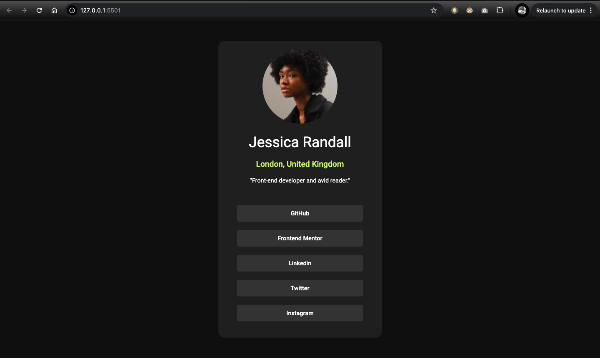
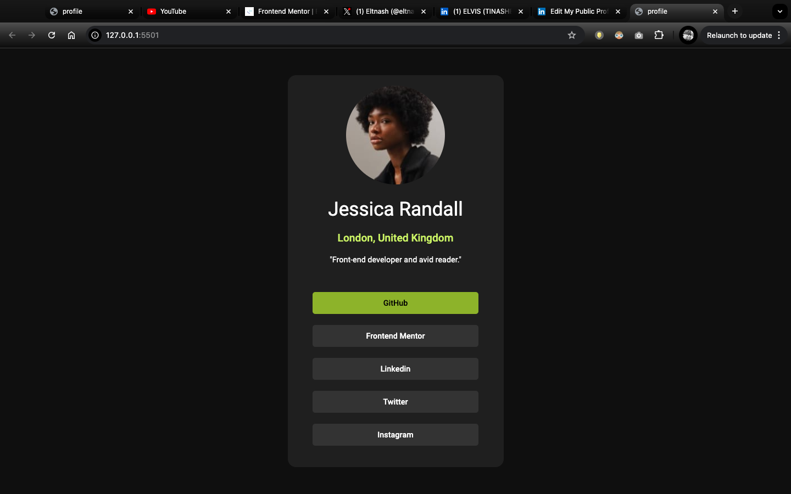

# social_media_profile_1
Building a Clean, Responsive Social Media Profile Card with HTML &amp; CSS

Frontend Mentor - Social Links Profile Solution
This is a solution to the Social links profile challenge on Frontend Mentor. Frontend Mentor challenges help you improve your coding skills by building realistic projects.

Table of contents
Overview
The challenge
Screenshot
Links
My process
Built with
What I learned
Continued development
Useful resources
Author

- [Overview](#overview)
  - [The challenge](#the-challenge)
  - [Screenshot](#screenshot)
  - [Links](#links)
- [My process](#my-process)
  - [Built with](#built-with)
  - [What I learned](#what-i-learned)
  - [Continued development](#continued-development)
  - [Useful resources](#useful-resources)
- [Author](#author)
- [Acknowledgments](#acknowledgments)

## Overview

For this project, I built a simple yet elegant profile card that displayed a user’s image, name, location, bio, and social links. The objective was to make the card functional, visually engaging, and flexible across different screen sizes, all while keeping the design clean and focused.

### The challenge
Users should be able to:

View hover and focus states for all interactive elements on the page

### Screenshot

 # Mobile view
 # Hover effect

Links
Solution URL: Add solution URL here
Live Site URL: Add live site URL here

## My process
### Built with
- Semantic HTML5 markup
- CSS custom properties
- Flexbox
- Mobile-first workflow

### What I learned

This project helped me sharpen several key skills in responsive web design:

### Responsive Layouts: 
I used  Flexbox to create a layout that adapts smoothly to different screen sizes. This tools allowed me to focus on alignment and spacing without relying on fixed positions.

### Media Queries: 
By adding media queries, I could adjust font sizes, element spacing, and layout structure to fit mobile, tablet, and desktop screens, ensuring a consistent user experience.

### Interactive States: 
I incorporated hover effects for links and social icons, making the card interactive and visually engaging on desktop while ensuring it remained touch-friendly on mobile.

These concepts and tools are critical in modern web design and will form the foundation of my future projects.

### Continued development

Moving forward, I want to deepen my understanding of:

Advanced CSS Techniques: Learning more about responsive units like vw/vh and experimenting with CSS animations.
JavaScript Integration: For future projects, I plan to add more interactive functionality with JavaScript to enhance user experience.
Useful resources
CSS Tricks: A Complete Guide to Flexbox - This guide was essential in helping me understand Flexbox properties and how to apply them in a responsive layout.
MDN Web Docs: Responsive Web Design Basics - A foundational resource that guided my understanding of responsive principles and best practices.
Author

linkedin - www.linkedin.com/in/elvisdzvimbo2a313763
Frontend Mentor - @eltnash
Twitter - @@eltnash92

